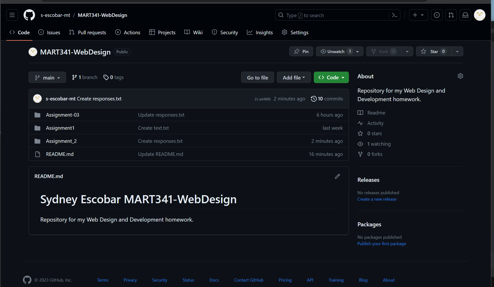

# Assignment 2 notes

 - (\\) Used to show special symbols or start new line ``` ex. \\ -> \; \` -> ` ```
 - (\```) Used to show the code
 - (__) __bold__
 - (_) _italic_
   
[Descriptive text for link to responses](./responses.txt)\

